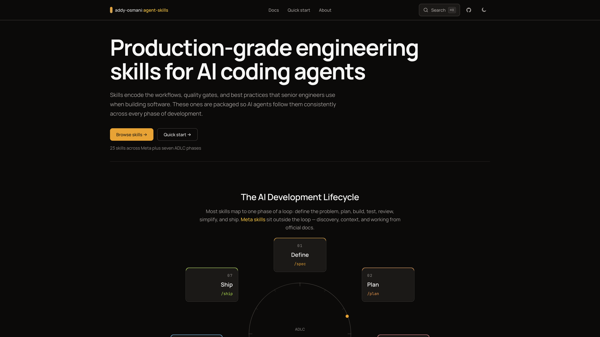

# addy-osmani-skills

A browsable home for [Addy Osmani](https://addyosmani.com)'s [agent-skills](https://github.com/addyosmani/agent-skills) — organized by the AI Development Lifecycle (ADLC), searchable, and easy to read on any screen.

**Live:** [addy-osmani-skills.vercel.app](https://addy-osmani-skills.vercel.app)

> Personal tribute project. Not official, not affiliated with Addy Osmani.

## What is this?

[Addy Osmani](https://addyosmani.com) published a collection of **agent skills** — structured guides that help AI coding tools follow the same workflows senior engineers use: spec before code, small tasks, tests as proof, review, simplify, and ship.

This site turns that collection into something you can **browse, search, and read** without digging through a repo. Skills are grouped by where they fit in the development lifecycle, with a quick-start page for installing them in your editor.

## Where to start

| Page | What it's for |
| --- | --- |
| [Home](https://addy-osmani-skills.vercel.app/) | Overview and the ADLC loop |
| [Docs](https://addy-osmani-skills.vercel.app/docs) | Browse every skill |
| [Quick start](https://addy-osmani-skills.vercel.app/quickstart) | Get skills into your AI tool |
| [About](https://addy-osmani-skills.vercel.app/about) | Credits and context |

New here? Open **Docs**, pick a phase that matches what you're doing (e.g. **Define** before a new feature), and read the skill that fits.

## Credits

- **Skills content** — [Addy Osmani](https://addyosmani.com) · [github.com/addyosmani/agent-skills](https://github.com/addyosmani/agent-skills)
